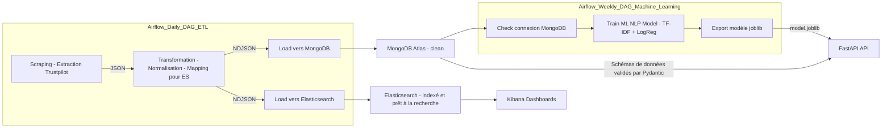
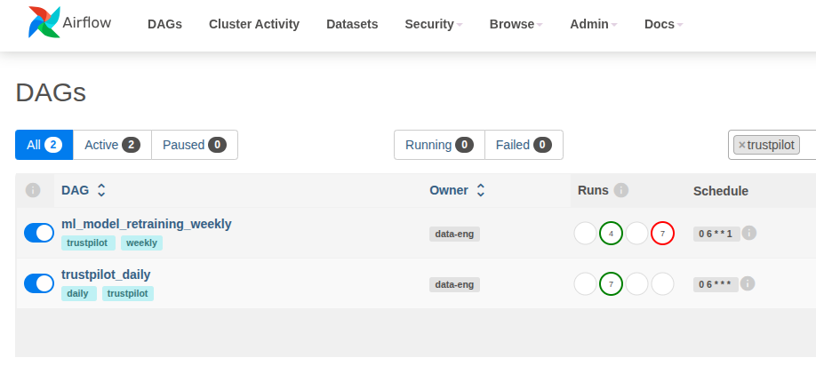
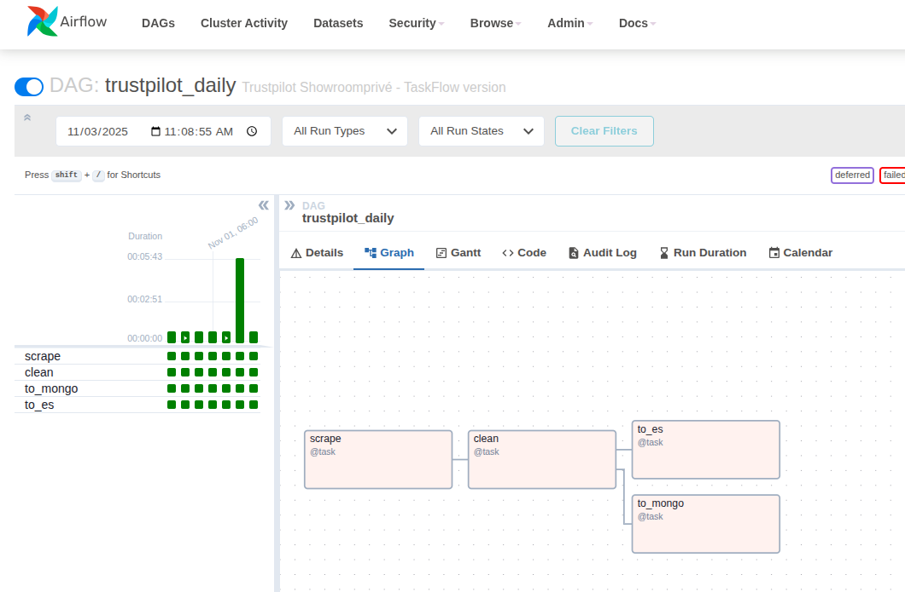
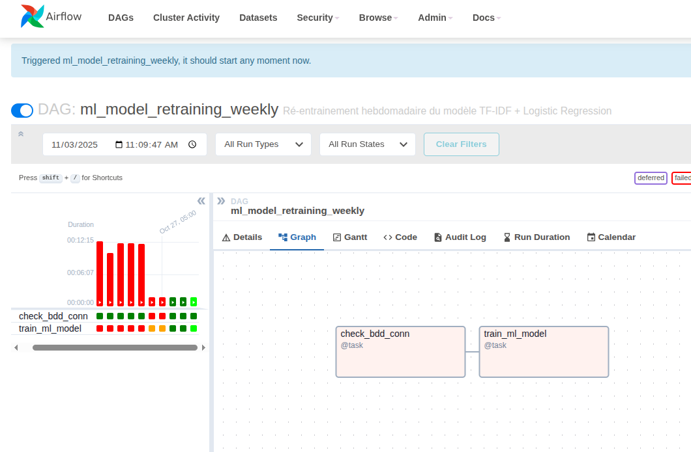
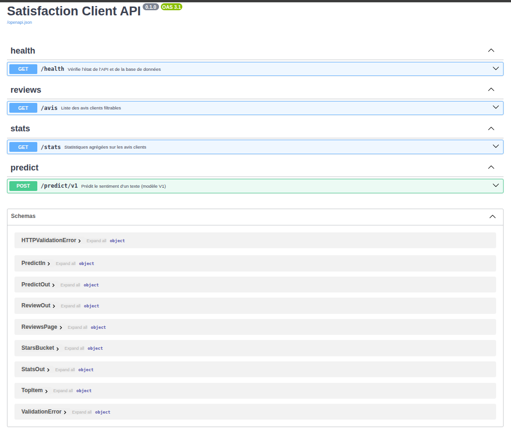
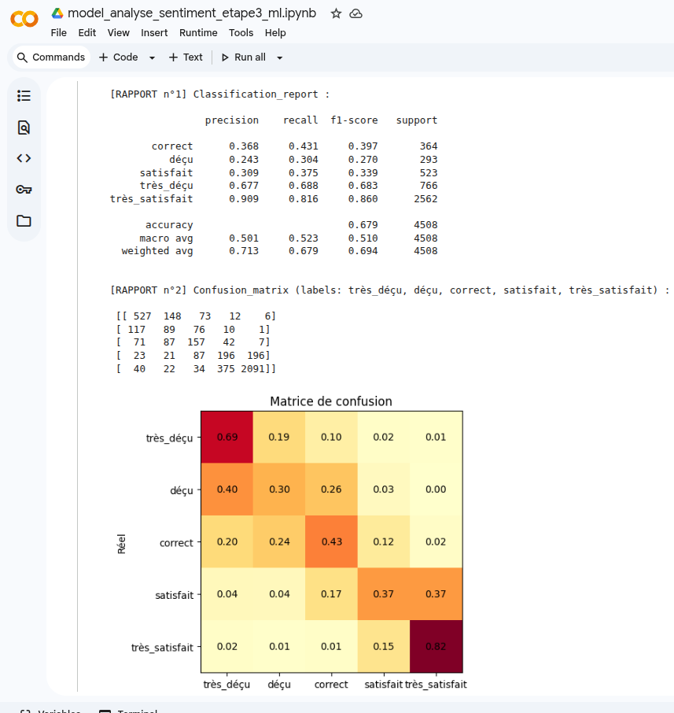
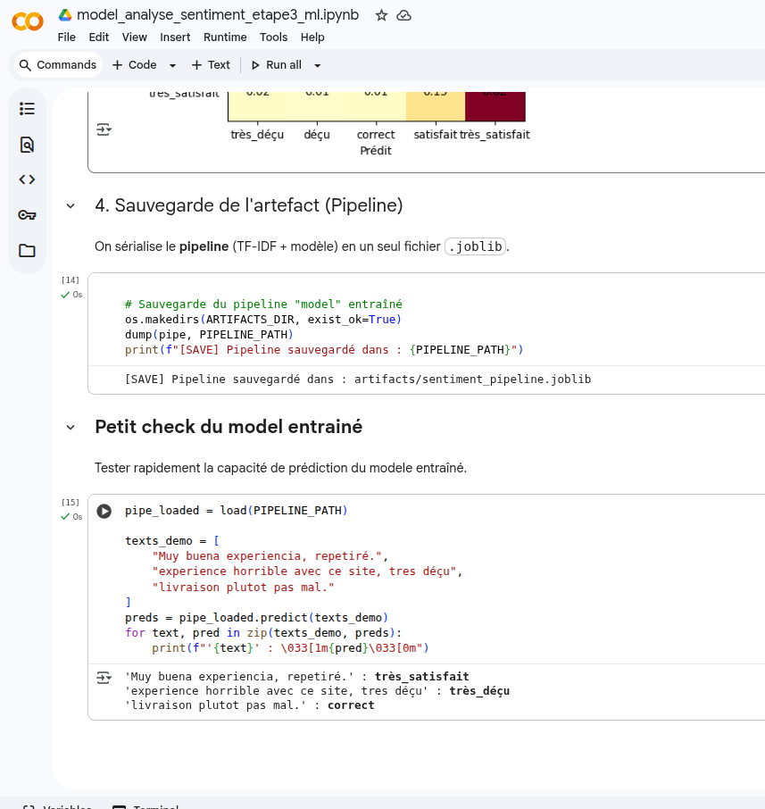

# Pipeline hybride Data Engineering & Machine Learning – Analyse et prédiction du sentiment client à partir des avis Trustpilot


---

## Description du pipeline :

Pipeline hybride Data Engineering & Machine Learning, orchestré avec Airflow, comprenant :

- Un DAG ETL quotidien pour le scraping, la transformation et le chargement des données dans MongoDB et **Elasticsearch  
- Un DAG Machine Learning hebdomadaire dédié au réentraînement du modèle NLP basé sur TF-IDF + Logistic Regression  
- Une API REST exposant le modèle de Machine Learning pour la prédiction en temps réel, ainsi que les données issues d'une base de données MongoDB  
- Une recherche textuelle optimisée et une visualisation avancée grâce à un index Elasticsearch bien mappé et à des dashboards Kibana interactifs  

---

## Objectif :

Automatiser l’analyse de la satisfaction client à partir des avis Trustpilot, en centralisant les données dans MongoDB et en exploitant un modèle de Machine Learning pour prédire le sentiment. Et aussi visualiser les tendances dans Kibana.  

**NB :** Le projet utilise les avis publics Trustpilot du site *Showroomprive.com* à titre d’exemple de cas d’étude.

---

## Architecture globale :


## Commandes clés

Un Makefile est mis en place pour simplifier le déploiement et la gestion de l’infrastructure Docker.

```bash
make up-all         # Lancer l’ensemble des conteneurs (Airflow, API, Elasticsearch)
make down-all       # Stopper et supprimer les conteneurs
make logs-api       # Afficher les logs du service FastAPI
```

## Captures d’écran

[](docs/screenshots/Airflow/Airflow_dags.png)
[](docs/screenshots/Airflow/Dag_ETL_daily.png)
[](docs/screenshots/Airflow/Dag_ML_weekly.png)
[](docs/screenshots/API/Endpoints_API_FastAPI.png)

[](docs/screenshots/Dashboard_kibana_Elasticsearch/Répartition%20des%20notes%20livraison.png)
[](docs/screenshots/Dashboard_kibana_Elasticsearch/Évolution%20mensuelle%20des%20avis%20mentionnant.png)
[](docs/screenshots/Ml_Modele/Classification_report_Confusion_matrix.png)
[](docs/screenshots/Ml_Modele/sauvegard_et_check_du_modele_entrainé.png)

---

## Exemples de requetes pour L'API FastApi :

L’API expose trois endpoints principaux :  
- `/predict/v1` : Prédire le sentiment d’un avis client  
- `/avis` : Récupérer les avis stockés dans MongoDB  
- `/stats` : Obtenir des statistiques agrégées sur les sentiments  

---

### 🔹 1. Prédiction de sentiment (`/predict/v1`)

**Requête :**
```bash
curl -X POST "http://localhost:8000/predict/v1" \ -H "Content-Type: application/json" \ -d '{"text": "Livraison rapide et service impeccable !"}'
```

### 🔹 2. Récupération des avis (/avis)
```bash
curl -X 'GET' \
  'http://localhost:8000/avis?stars=2&pays=france&sort=date_desc&limit=100' \ -H 'accept: application/json'
```

### 🔹 3. Statistiques globales (/stats)
```bash
curl -X 'GET' \
  'http://localhost:8000/stats?stars=2&langue=fr' \ -H 'accept: application/json'
```

---

## 👨‍💻 Auteur

**Abderraouf Boukarma**  

Pipeline conçu dans le cadre du projet de fin d’études _Trustpilot Sentiment-Analysis Pipeline_ – formation **Data Engineer (École des Mines x DataScientest)**  

📧 **Email :** [boukarmaabderraouf@gmail.com](mailto:boukarma.abderraouf@gmail.com)  
🌐 **LinkedIn :** [linkedin.com/in/abderraouf-boukarma](https://www.linkedin.com/in/abderraouf-boukarma)  
💻 **GitHub :** [github.com/AbderraoufBou14](https://github.com/AbderraoufBou14)
