# 🧠 Trustpilot Showroomprivé Sentiment Pipeline


---

## projet

Pipeline complet de Data Engineering et de Machine Learning pour l’analyse des avis Trustpilot (cas Showroomprivé.com), conçu pour être facilement déployable et portable via Docker Compose.

Objectifs : 
    - Centraliser les avis clients collectés sur Trustpilot dans une base de données NoSQL (MongoDB Atlas).
    - Prédire automatiquement le sentiment client (positif ou négatif) grâce à un modèle de Machine Learning.
    - Alimenter des tableaux de bord Kibana pour une recherche textuelle optimisée et une analyse visuelle approfondie des avis.
    
---

## 🧩 Architecture globale

```mermaid
flowchart LR
    subgraph A[Airflow DAGs]
        A1[Scraping Task]
        A2[Cleaning & Transformation]
        A3[Training ML Model]
        A1 --> A2 --> A3
    end

    A1 --> B[Raw Data, JSON]
    B --> C[Transformation & Normalization & Mapping pour ES]
    C -->|NDJSON| D[MongoDB Atlas - clean]
    C -->|NDJSON| E[Elasticsearch]
    D --> F[Modèle ML, TF-IDF + Logistic Regression - scikit-learn]
    D -->|Base MongoDB| G[FastAPI API]
    F -->|model.joblib| G
    E --> H[Kibana Dashboards]

    subgraph I[Automation]
        M[Makefile, build, up, down, logs]
    end
    M --> A
    M --> G
```

## ⚙️ Commandes clés
```bash
make up-all        # Lancer toute la stack infra ( conteneurs docker )
make down-all      # Stopper les conteneurs
make logs-api      # Voir les logs FastAPI
```

## 📸 Captures (à insérer)
- docs/screenshots/kibana_dashboard.png
- docs/screenshots/api_docs.png

---

## 📈 Exemple d'utilisation
```bash
curl -X POST "http://localhost:8000/predict/v1"      -H "Content-Type: application/json"      -d '{"text": "Livraison rapide et produit conforme"}'
```
Réponse :
```json
{"label": "positive", "probability": 0.93}
```

---

## 🧱 Auteur
**Abderraouf Boukarma**  
📧 boukarmaadberraouf@gmail.com  
🔗 [GitHub](https://github.com/AbderraoufBou14)
